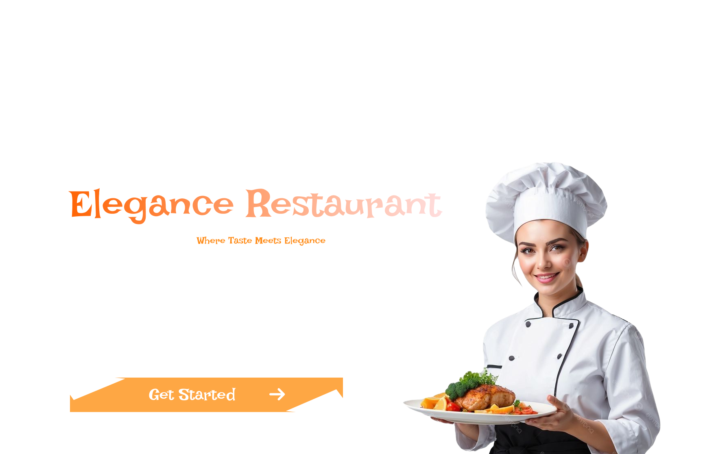

# Elegance Restaurant Full-stack app

Elegance Restaurant 

Full Stack Web Application  Elegance Restaurant is a full-stack web application built to manage a modern restaurant experience. The application provides a responsive frontend, secure backend APIs, and a relational database for data persistence.  

## 🚀 Tech Stack  
- **Frontend** - React.js 
- **Backend** - Java Spring Boot (REST APIs)
- **Database**: SQL (PostgreSQL / MySQL)

## ✨ Features
- Browse restaurant menu
- Create and manage orders
- Admin dashboard for menu & order management
- RESTful API architecture
- Responsive UI
- Secure backend with validation

## 🏗️ Architecture
      React (Frontend)
        ↓ REST API
      Spring Boot (Backend)
        ↓ JPA / Hibernate
      SQL Database

## 🛠️ Tools & Technologies
- Spring Boot
- Spring Data JPA
- REST APIs
- React Hooks
- Axios / Fetch API
- SQL Database

## 📂 Recommended Repository Structure
      elegance-restaurant/
       ├── backend/        (Spring Boot)
       ├── frontend/       (React)
       ├── README.md
       ├── .gitignore
       └── LICENSE
## 📸 Screenshots

## 📦 How to Run Locally
1. Clone the repository
2. Start the Spring Boot backend
3. Start the React frontend
4. Access the app in your browser

## 📌 Future Improvements
- Authentication & authorization
- Online payment integration
- Table reservations
- Docker support
